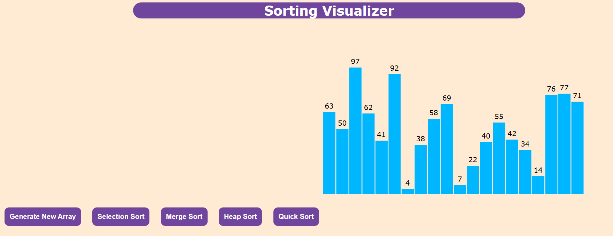
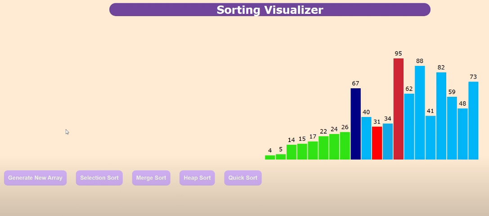

# Running the Visualizer

To run the visualizer, simply open `index.html` with a browser by right-clicking the file and selecting "Open with," then choose your browser of choice.

## Operating Guidelines

1. **Initial Display:**
   - Upon opening or refreshing the page, you will see a set of blue unsorted bars with their labels. This is the expected start behavior.
     

2. **Running a Sort:**
   - Click one of the sort options. The sort animation starts and runs to completion.
   - The buttons are disabled while the animation is running, and are re-enabled once the sort animation is complete.
  
     

   **NOTE:** Depending on the sorting algorithm used (e.g., Merge sort, Selection sort, Quick sort), the completed sort will display as a set of green bars, while Heap sort will show pink bars. Intermediate sorting colors vary by algorithm. Regardless of color changes, the numbers and bar heights should be properly sorted.

3. **Starting a New Sort:**
   - To initiate a new sort, click "Generate New Array" or refresh your page. If not, the next sort animation may still run but will not function properly, leading to unclear results and behavior.

## Code Structure

- **Logic:** The JavaScript logic for the visualizer is contained within the `js` folder.
- **Styling:** Visual specifications are defined in the `css` folder.
- **Important:** Do not move `index.html`, `index.js`, or `styles.css` as `index.html` references them based on their relative paths.

HTML and CSS setup from here 
//Sources
//Title: Selection Sort Visualizer in Javascript
//CSS,HTML, and Selection sort used as base to stylize and build project
//Reference Pages: https://www.geeksforgeeks.org/selection-sort-visualizer-in-javascript/

