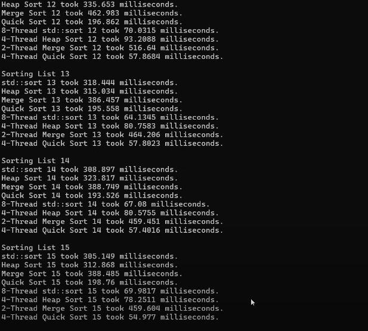

# Welcome to the Sorting Algorithms Project Repository

This repository is a learning tool developed to explore and demonstrate the performance and visualization of **Sorting Algorithms** through both a C++ runtime simulator and a JavaScript-based visualizer.

## Project Overview

The project consists of two major components aimed at showcasing how various sorting algorithms (such as QuickSort, MergeSort, HeapSort, and Selection Sort) function:

1. **C++ Sorting Algorithm Runtime Simulator**:
   - This tool simulates the runtime of different sorting algorithms and analyzes their efficiency across various input sizes.
   - The simulator can be found in the `src` folder, along with a detailed `README.md` that explains how to run the program.
   - 

2. **JavaScript Sorting Algorithm Visualizer**:
   - An interactive visual tool that displays how sorting algorithms work step-by-step, allowing users to visualize the sorting process.
   - The visualizer is located in the `Javascript_Visualizer` folder, with its own `README.md` containing setup instructions.
   - 

---

## My Contribution

As part of this group project, my primary contribution was developing the **JavaScript Sorting Algorithm Visualizer**. This component allows users to interact with and visualize the inner workings of various sorting algorithms in real time.

### Key Contributions:
- Designed and implemented the front-end logic and UI for the sorting algorithm visualizer using **HTML**, **CSS**, and **JavaScript**.
- Developed visual representations for algorithms like **QuickSort**, **MergeSort**, and **HeapSort** to make the learning process intuitive for users.
- Implemented user controls for adjusting input sizes and visualizing the speed of sorting operations.

---

## Skills & Technologies Utilized

- **Languages**: JavaScript, C++, HTML, CSS
- **Algorithms**: QuickSort, MergeSort, HeapSort, Selection Sort
- **Tools**: Git, Visual Studio Code
- **Collaboration**: Worked within a team environment, using Git for version control and managing collaborative efforts on different parts of the project.

---

## How to Explore the Project

To explore and test the sorting algorithms:

1. **C++ Sorting Algorithm Runtime Simulator**:
   - Navigate to the `src` folder and follow the instructions in the associated `README.md` file.

2. **JavaScript Sorting Algorithm Visualizer**:
   - Navigate to the `Javascript_Visualizer` folder.
   - Refer to the `README.md` for steps on running the visualizer in your browser.

---

## Additional Notes

- The `resources` folder and `TemplateUseDoc.md` are part of the original project template and are not directly used in this version of the project.

---

Feel free to explore the repository and experiment with both the simulator and visualizer. Contributions and suggestions are welcome!

